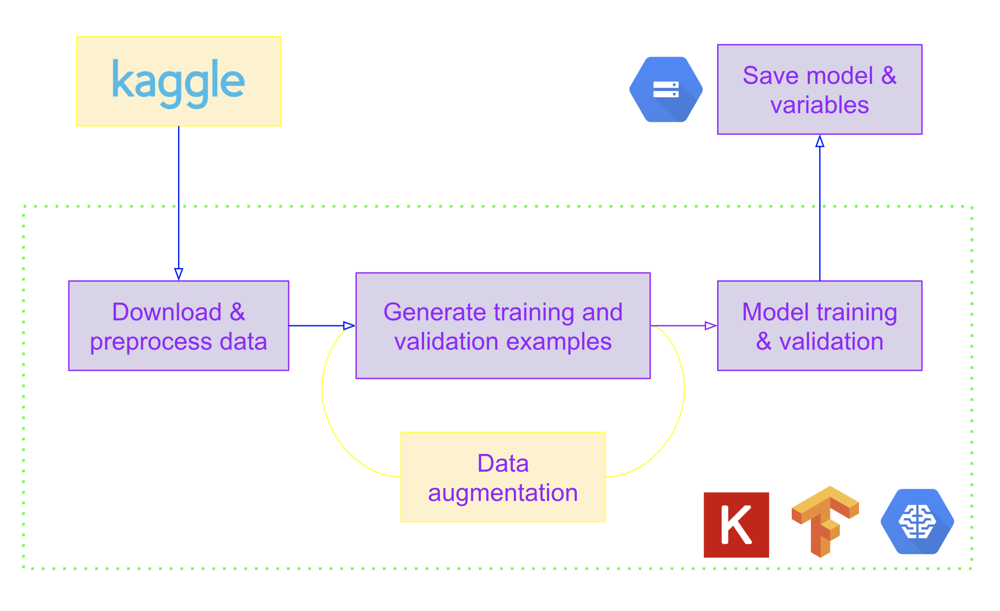

# Tensorflow 🧡 Keras mole image classifier

Trains sequential Keras model on Skin Cancer MNIST: HAM10000 dataset from Kaggle. Training supports local machine and AI Platfrom.

## 📒 Contents

- `notebooks`: Exploratory Jupyter notebooks
- `scripts`: Bash scripts for local and cloud training
- `trainer`: AI platform trainer module
    - `model.py`: Defines a Keras model and input function for training
    - `task.py`: Trains a Keras model to predict cancer class
    - `util.py`: Utilities to download and preprocess data

## 📈 Solution diagram

<kbd>
  
</kbd>

## 🚀 Get started

First, install the requirements.

```bash
pip install -r requirements.txt
```

To start training either locally or on AI Platfro you need to create an environment variable called `KAGGLE_KEY` which has to point to a json file containing your Kaggle API key. For more information about how to generate and download your API key from Kaggle, visit the [Kaggle API Github page](https://github.com/Kaggle/kaggle-api#api-credentials).

```bash
export KAGGLE_KEY="path/to/my/kaggle.json"
```

## 💻 Local training

To train the Keras model locally, run `train-local.sh`.

```bash
sh scripts/train-local.sh
```

If you'd like to update the training parameters, edit `train-local.sh` file and add your desired values.

## ☁️ Train on AI Platform

To train the Keras model on AI Platform, you need to create a Google Cloud project. For more information on how to create a project on Google Cloud Platform, visit the [documentation](https://cloud.google.com/ai-platform/docs/getting-started-keras).

Next, create a Storage bucket where you can store all the logs, checkpoints and SavedModels. Set the name of the bucket as environment variable.

```bash
export BUCKET_NAME="my-bukcet-name"
```

Enable the AI Platform API in your projects. After that you are all set to run `train.sh`.

```bash
sh scripts/train.sh
```
